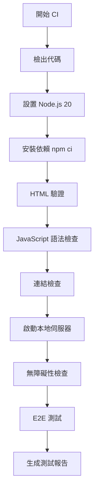

# CI/CD 測試流程指南

本文檔說明 MultiStream Hub 專案的 CI/CD 測試流程，包括所有測試類型和 E2E 測試的啟動方式。

## 📋 目錄

- [測試類型概述](#測試類型概述)
- [CI/CD 流程](#cicd-流程)
- [本地測試執行](#本地測試執行)
- [E2E 測試詳細說明](#e2e-測試詳細說明)
- [測試環境要求](#測試環境要求)
- [故障排除](#故障排除)

---

## 測試類型概述

本專案包含以下測試類型：

### 1. HTML 驗證 (`test:html`)
- **工具**: `html-validate`
- **目的**: 檢查 HTML 文件的語法和結構
- **檢查文件**: `index.html`, `privacy.html`, `about.html`
- **配置**: `.htmlvalidate.json`

### 2. JavaScript 語法檢查 (`test:js`)
- **工具**: `ESLint`
- **目的**: 檢查 JavaScript 代碼的語法錯誤和風格問題
- **檢查文件**: `js/**/*.js`
- **配置**: `.eslintrc.json`

### 3. 連結檢查 (`test:links`)
- **工具**: `linkinator`
- **目的**: 驗證頁面中的所有連結是否有效
- **檢查文件**: `index.html`, `privacy.html`, `about.html`
- **跳過**: Google Forms 連結（`https://forms.gle`）

### 4. 無障礙性檢查 (`test:a11y`)
- **工具**: `pa11y`
- **目的**: 檢查網頁的無障礙性（WCAG 2.0 AA 標準）
- **目標 URL**: `http://localhost/index.html`
- **標準**: WCAG2AA

### 5. E2E 測試 (`test:e2e`)
- **工具**: `Playwright`
- **目的**: 端到端測試，模擬用戶操作驗證功能
- **測試文件**: `tests/*.spec.js`
- **配置**: `playwright.config.js`

---

## CI/CD 流程

### GitHub Actions 工作流程

CI/CD 流程在 `.github/workflows/ci.yml` 中定義，當以下事件發生時自動觸發：

- **推送代碼**到任何分支
- **創建 Pull Request**
- **手動觸發**（workflow_dispatch）

### 測試執行順序



### 詳細步驟

#### 1. 環境準備
```yaml
- 檢出代碼
- 設置 Node.js 20
- 安裝依賴 (npm ci)
```

#### 2. 靜態測試
```yaml
- HTML 驗證 (test:html)
- JavaScript 語法檢查 (test:js)
- 連結檢查 (test:links)
```

#### 3. 動態測試
```yaml
- 啟動本地伺服器 (Python http.server)
- 無障礙性檢查 (test:a11y)
- E2E 測試 (test:e2e)
```

#### 4. 報告生成
```yaml
- 生成測試結果總結
- 上傳測試報告（如果失敗）
```

---

## 本地測試執行

### 前置要求

1. **Node.js**: >= 18.0.0
2. **npm**: 最新版本
3. **XAMPP Apache 服務器**: 運行在 `http://localhost`

### 安裝依賴

```bash
npm install
```

### 執行所有測試

```bash
npm test
```

### 執行單個測試類型

```bash
# HTML 驗證
npm run test:html

# JavaScript 語法檢查
npm run test:js

# 連結檢查
npm run test:links

# 無障礙性檢查（需要本地伺服器運行）
npm run test:a11y

# E2E 測試（需要本地伺服器運行）
npm run test:e2e
```

---

## E2E 測試詳細說明

### 測試環境配置

E2E 測試使用 Playwright，配置在 `playwright.config.js` 中：

- **基礎 URL**: 
  - 本地: `http://localhost` (XAMPP Apache 服務器)
  - CI: `http://localhost:8000` (Python http.server，通過環境變量 `BASE_URL` 設置)
- **測試目錄**: `./tests`
- **超時時間**: 30 秒
- **重試次數**: CI 環境 2 次，本地 0 次
- **並行執行**: CI 環境 1 個 worker，本地自動
- **環境變量**: 通過 `BASE_URL` 環境變量動態設置基礎 URL
- **視頻錄製**: 僅在測試失敗時保留（`retain-on-failure`）
- **截圖**: 僅在測試失敗時截圖（`only-on-failure`）

### 測試文件結構

```
tests/
├── basic.spec.js          # 基本功能測試
├── layout.spec.js         # 布局功能測試
├── stream.spec.js         # 串流管理測試
├── favorite.spec.js        # 收藏功能測試
├── volume.spec.js         # 音量控制測試
├── chat.spec.js           # 聊天室功能測試
├── i18n.spec.js           # 多國語言測試
├── helpers.js             # 測試輔助函數
└── test-data.js           # 測試數據
```

### 啟動 E2E 測試

#### 方法 1: 使用 npm 腳本（推薦）

```bash
# 確保 XAMPP Apache 服務器正在運行
# 訪問 http://localhost 確認網站可訪問

# 執行所有 E2E 測試（使用默認 baseURL: http://localhost）
npm run test:e2e

# 使用自定義 baseURL 執行測試
BASE_URL=http://localhost:8000 npm run test:e2e

# 執行特定測試文件
npx playwright test tests/basic.spec.js

# 執行特定測試
npx playwright test tests/basic.spec.js -g "頁面應該正確載入"

# 使用 UI 模式（可視化測試執行）
npx playwright test --ui

# 調試模式（逐步執行）
npx playwright test --debug
```

#### 方法 2: 直接使用 Playwright CLI

```bash
# 安裝 Playwright 瀏覽器（首次使用）
npx playwright install chromium

# 執行測試
npx playwright test

# 查看測試報告
npx playwright show-report
```

### E2E 測試內容

#### 1. 基本功能測試 (`basic.spec.js`)
- 頁面載入
- URL 輸入框
- 布局按鈕存在性
- 音量控制存在性
- 語言選擇器存在性
- 頁面導航

#### 2. 布局功能測試 (`layout.spec.js`)
- 單一畫面布局
- 左右分割布局
- 四宮格布局
- 雙欄聊天布局（Layout 13）
  - 添加串流 → 切換布局 → 等待聊天室載入 → 收起控制面板觀察
- 四格聊天布局（Layout 14）
  - 添加串流 → 切換布局 → 等待聊天室載入 → 收起控制面板觀察

#### 3. 串流管理測試 (`stream.spec.js`)
- 添加 Twitch 串流
- 添加 YouTube 串流
- 添加多個串流
- 移除單個串流
- 串流順序列表

#### 4. 收藏功能測試 (`favorite.spec.js`)
- 打開收藏管理界面
- 添加收藏
- 新增分類
- 修改收藏名稱
- 修改收藏分類
- 一鍵載入收藏（>=2 個）
- 刪除收藏

#### 5. 音量控制測試 (`volume.spec.js`)
- 調整總音量
- 全部靜音
- 取消全部靜音
- 調整單個串流音量
- 音量值顯示更新

#### 6. 聊天室功能測試 (`chat.spec.js`)
- 顯示/隱藏聊天室
- 顯示所有聊天室
- 側邊聊天布局寬度調整
  - 添加串流 → 切換布局 → 等待聊天室載入 → 展開控制面板 → 調整寬度 → 收起控制面板觀察
- 側邊聊天布局選擇聊天室
  - 添加串流 → 切換布局 → 等待聊天室載入 → 收起控制面板 → 選擇聊天室

#### 7. 多國語言測試 (`i18n.spec.js`)
- 語言切換
- 語言持久化

### 測試輔助函數 (`helpers.js`)

提供可重用的測試函數：

- `waitForPageLoad()` - 等待頁面完全載入
- `ensureControlPanelExpanded()` - 確保控制面板展開
- `collapseControlPanel()` - 收起控制面板
- `addTestStream()` - 添加測試串流
- `clearAllStreams()` - 清空所有串流
- `openFavoriteManager()` - 打開收藏管理界面
- `closeFavoriteManager()` - 關閉收藏管理界面
- `switchLayout()` - 切換布局
- `toggleAllChats()` - 顯示/隱藏所有聊天室
- `applyChatWidth()` - 應用聊天室寬度

### 測試數據 (`test-data.js`)

包含實際正在串流的 URL：

- Twitch: `https://www.twitch.tv/muse_tw`, `https://www.twitch.tv/muse_tw2`
- YouTube: `https://www.youtube.com/watch?v=xKXX4Fhrqqk`, `https://www.youtube.com/watch?v=KyT4qSK8lJo`

---

## 測試環境要求

### 本地開發環境

1. **XAMPP Apache 服務器**
   - 確保 Apache 正在運行
   - 專案文件位於 XAMPP 的 `htdocs` 目錄
   - 可通過 `http://localhost` 訪問

2. **Node.js 環境**
   ```bash
   node --version  # 應該 >= 18.0.0
   npm --version
   ```

3. **Playwright 瀏覽器**
   ```bash
   npx playwright install chromium
   ```

### CI 環境

- **運行環境**: Ubuntu Latest
- **Node.js**: 20.x
- **自動安裝**: 所有依賴和瀏覽器都會自動安裝

---

## 故障排除

### E2E 測試失敗

#### 問題 1: 無法連接到 `http://localhost`

**解決方案**:
```bash
# 確認 XAMPP Apache 正在運行
# 在瀏覽器中訪問 http://localhost 確認網站可訪問
```

#### 問題 2: 測試超時

**解決方案**:
- 檢查網路連接
- 確認串流 URL 是否可訪問
- 增加超時時間（在 `playwright.config.js` 中）

#### 問題 3: 元素找不到

**解決方案**:
- 檢查 JavaScript 是否完全載入
- 確認元素選擇器是否正確
- 查看測試視頻和截圖（在 `test-results/` 目錄）

#### 問題 4: 按鈕點擊無反應

**解決方案**:
- 測試已改為直接調用 JavaScript 函數，而非模擬點擊
- 檢查函數是否在全局作用域可用

### 其他測試失敗

#### HTML 驗證失敗
- 檢查 `.htmlvalidate.json` 配置
- 某些警告可以忽略（已在配置中設置）

#### JavaScript 語法檢查失敗
- 檢查 `.eslintrc.json` 配置
- 確認全局變數已正確聲明

#### 連結檢查失敗
- 某些外部連結可能暫時不可訪問
- Google Forms 連結已自動跳過

#### 無障礙性檢查失敗
- 某些問題可能不影響功能
- 檢查 `pa11y` 報告了解詳細問題

---

## CI/CD 配置更新

### CI 中的 E2E 測試配置

CI 配置已包含 E2E 測試，執行步驟如下：

```yaml
- name: 安裝 Playwright 瀏覽器
  run: npx playwright install --with-deps chromium

- name: 啟動本地伺服器（用於 E2E 測試）
  run: |
    python3 -m http.server 8000 &
    sleep 3

- name: E2E 測試
  env:
    CI: true
    BASE_URL: http://localhost:8000
  run: npm run test:e2e

- name: E2E 測試
  run: npm run test:e2e

- name: 上傳 Playwright 測試報告
  if: always()
  uses: actions/upload-artifact@v3
  with:
    name: playwright-report
    path: playwright-report/
    retention-days: 30

- name: 上傳測試結果（失敗時）
  if: failure()
  uses: actions/upload-artifact@v3
  with:
    name: test-results
    path: test-results/
    retention-days: 7
```

**注意**: 
- CI 環境使用 Python http.server 在端口 8000 啟動本地伺服器
- 通過環境變量 `BASE_URL` 設置為 `http://localhost:8000`
- 本地開發環境使用 XAMPP Apache 服務器在 `http://localhost`
- Playwright 配置會根據環境變量自動調整 baseURL
- E2E 測試會自動上傳測試報告和失敗時的測試結果（視頻、截圖）

---

## 測試最佳實踐

1. **測試前準備**
   - 確保本地伺服器運行
   - 清空瀏覽器緩存和 localStorage
   - 使用實際可訪問的串流 URL

2. **測試執行**
   - 使用實際的用戶操作流程
   - 直接調用 JavaScript 函數而非模擬點擊
   - 適當的等待時間確保元素載入
   - 布局測試時收起控制面板以便觀察效果
   - 確保重要元素（如聊天室寬度控制）滾動到視圖中

3. **測試維護**
   - 定期更新測試數據中的串流 URL
   - 當 UI 變更時更新選擇器
   - 保持測試輔助函數的可重用性

4. **CI/CD 集成**
   - 所有測試都設置 `continue-on-error: true`，不會阻止代碼推送
   - 測試報告會自動生成並上傳
   - 建議在推送到 main 分支前修復所有問題

---

## 相關文件

- CI 配置: `.github/workflows/ci.yml`
- Playwright 配置: `playwright.config.js`
- 測試文件: `tests/*.spec.js`
- 測試輔助函數: `tests/helpers.js`
- 測試數據: `tests/test-data.js`
- ESLint 配置: `.eslintrc.json`
- HTML 驗證配置: `.htmlvalidate.json`

---

## 聯繫與支持

如有問題或建議，請：
1. 查看測試失敗的詳細日誌
2. 檢查 `test-results/` 目錄中的視頻和截圖
3. 查看 Playwright 測試報告

---

**最後更新**: 2025-01-XX
